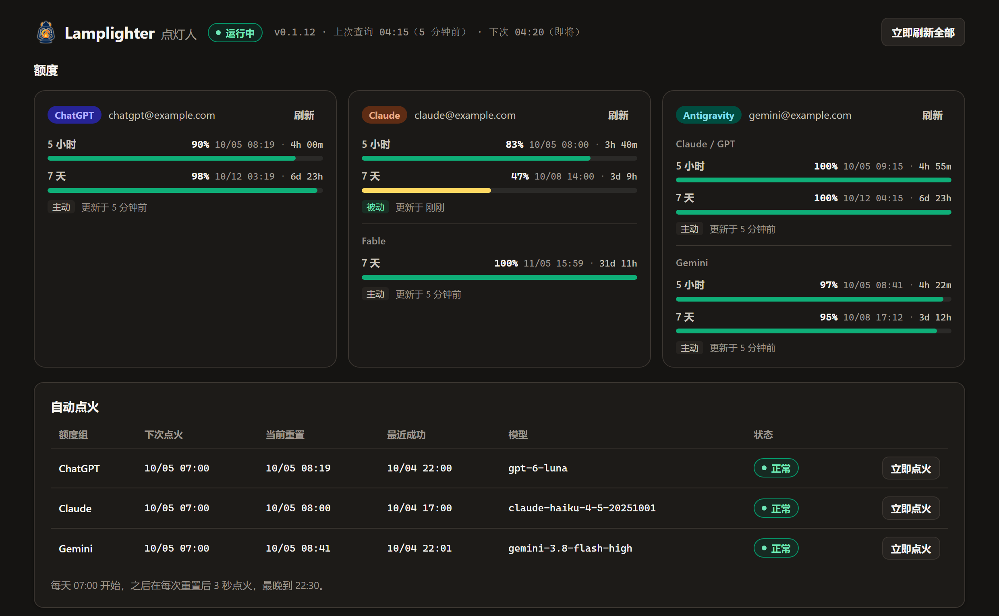
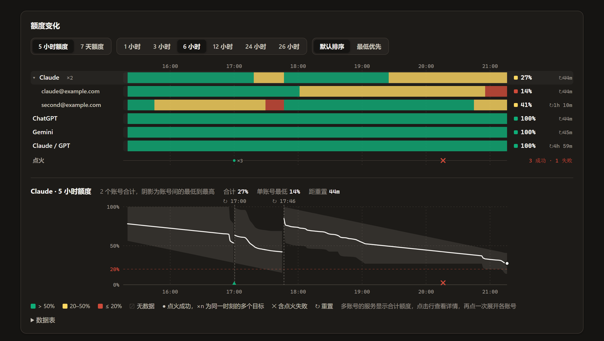

<p align="center"></p>

# Lamplighter

[中文](./README.md)

Lamplighter is a native plugin for [CLIProxyAPI](https://github.com/router-for-me/CLIProxyAPI) (CPA). It monitors the quota of ChatGPT (Codex), Claude and Antigravity accounts, sends alerts through [Bark](https://github.com/Finb/Bark), and sends one minimal request after each 5-hour quota window resets so that the next window starts right away.






## Features

- **Quota monitoring**: queries quota on a schedule and also reads the quota that upstream providers return while CPA serves real requests.
- **Bark notifications**: alerts when remaining quota drops to 50%, 20%, 10% and zero; optional recovery and pre-reset reminders; optional forwarding of [Did Codex Reset](https://didcodexreset.com/) signals.
- **Window ignition**: from 07:00 every day, sends a minimal request 3 seconds after each 5-hour reset, until 22:30. The request goes through CPA's own model executor and is pinned to one account.
- **Management page**: shows quota, ignition plans, events and a quota chart in the CPA Management Center, and edits the settings.

| Service | Monitored | Ignition by default |
| --- | --- | --- |
| ChatGPT / Codex | 5-hour and 7-day windows | On |
| Claude | 5-hour and 7-day windows, plus separately counted quotas such as Fable | On, 5-hour window only |
| Antigravity | Quota groups such as Gemini and Claude / GPT | Off; when on, Gemini only |

When a service has several accounts, notifications and the page tell them apart by the last two characters of the email user name, for example `ChatGPT#rk`.

## Requirements

- CPA v8.0.4 or later with plugins enabled (`plugins.enabled: true`). The plugin is built for Linux amd64/arm64, macOS amd64/arm64 and Windows amd64; the macOS builds are only built and tested in CI and have not been tried on a running CPA.
- A CPA API key reserved for Lamplighter. The plugin reads the model list with it to pick ignition models.
- An iPhone with Bark, if you want notifications.

## Installation

1. Download the zip for the system CPA runs on from [Releases](https://github.com/PosvdM/cpa-plugin-lamplighter/releases): on Linux, `linux_amd64` when `uname -m` prints `x86_64` and `linux_arm64` when it prints `aarch64`; `darwin_arm64` for Apple silicon Macs, `darwin_amd64` for Intel Macs; `windows_amd64` for Windows.
2. Extract the library (`lamplighter-v<version>.so` on Linux, `.dylib` on macOS, `.dll` on Windows) into the `<os>/<arch>/` folder of the CPA plugin directory, for example `plugins/linux/arm64/` or `plugins/windows/amd64/`. In a Docker deployment the plugin directory is the host folder mounted at `/CLIProxyAPI/plugins`.
3. Add an API key to CPA's `config.yaml` and enable the plugin:

   ```yaml
   access:
     api-keys:
       - "existing key"
       - "new key for Lamplighter"
   plugins:
     enabled: true
     configs:
       lamplighter:
         enabled: true
         models_api_key: "new key for Lamplighter"
         bark_url: "https://api.day.app/your_device_key"
   ```

4. Restart CPA (`docker compose restart` in a Docker deployment). The plugin runs its first query about 20 seconds after CPA starts.
5. Open **Lamplighter** in the Management Center sidebar. If you signed in to the Management Center with "remember password", the page uses that key; otherwise it asks for one.

To upgrade, put the new library in the same folder, delete the old one and restart CPA.

The plugin keeps its state and quota history in `data/lamplighter/` under the plugin directory. In a Docker deployment that directory is on the host, so recreating the container keeps the data.

## How quota is read

**Active queries** run every 5 minutes by default, at minutes `00 / 05 / 10 / ... / 55` of each hour. In addition, the plugin queries the account once 30 seconds before and once 30 seconds after each quota window resets: the first records what is left at the end of the cycle, the second confirms the new cycle and sends the recovery notification without waiting for the next poll. A query is skipped when a newer reading already exists. Queries use the same URLs and headers as the quota page of the CPA Management Center.

**Passive data**: when a Claude or Codex model request passes through CPA, the provider returns the current quota in the response, and the plugin uses it without an extra request. Antigravity returns no such data and is only queried actively.

If an account produced passive data in the 60 seconds before a scheduled query, that query is skipped for the account. An account is skipped for at most 30 minutes in a row; after that it is queried actively, so that quotas missing from the response headers, such as an unused Claude Fable quota, stay current. The chart does not draw this planned interval as missing data.

Claude and Codex quotas have 1% precision, whether queried or read passively. Antigravity queries return decimals.

**Network exit**: active queries leave through the same exit that CPA uses for model requests of the account: the account's `proxy_url`, then the global `proxy-url`, then proxies from environment variables, then a direct connection. When an account's `proxy_url` cannot be parsed, the plugin skips the query instead of connecting directly.

## Window ignition

A 5-hour window starts with the first request after a reset. If nobody uses the account after a reset, no window runs. Lamplighter sends a request right after each reset so that the windows follow each other:

- Times use the plugin time zone, which follows the CPA server by default.
- The first ignition each day is at `07:00`; after that, 3 seconds after each reset, until `22:30`. A reset later than that waits for 07:00 the next day.
- The request asks the model to reply `OK`, declares no tools and allows at most 4 output tokens.
- Models are picked automatically: the newest Luna for ChatGPT, the newest Haiku for Claude, and the newest Flash for Antigravity's Gemini group. They can also be set in the config.
- An ignition counts as successful only when the 5-hour window afterwards has a fixed reset time in the future.

**Failure protection**:

- Authentication failures, rate limits (429), unavailable models, or a request that succeeded without starting the window pause ignition for that quota group until 07:00 the next day, with one Bark notification.
- Network and server errors are retried after 5 and 15 minutes; a third failure also pauses until the next day.
- When the quota ran out before the reset, CPA cools the account down until a dozen or so seconds after the reset. An ignition that hits this cooldown retries as soon as it ends and is not counted as a failure.
- When the account's 7-day quota (or another window other than the 5-hour one) is used up, scheduled ignition for the quota group stops until that window resets and a query shows the quota is back; the page shows "7 天额度已用完". "Ignite now" still works.
- When the quota comes back early, for example after a reset card, while CPA still cools the account down until the original reset, CPA rejects every request and ignition in between. The plugin sends one ⚠️ notification and shows a note on the account card; clear the account's cooldown in the CPA Management Center.

## Notification example

Notifications use the Management Center language from the last time the management page was opened, Chinese or English; until the page has been opened, they are in Chinese.

```text
🟡 Claude · 7d 48% | 03d

5h: 96% | 04h | 10/04 13:50
7d: 48% | 03d | 10/07 14:00
```

Title icons: 🟡 remaining fell to the first threshold (50% by default), 🔴 to the second threshold (20% by default) or below, ✅ recovered, ⏰ reset reminder, ⚠️ a problem that needs action, such as ignition paused or a CPA cooldown that outlasts the quota. Each body line shows the window, the remaining quota, the time until reset, and the reset time. The first time the plugin sees a quota window it only records the current level and sends nothing.

## Configuration

All settings live under `plugins.configs.lamplighter` in `config.yaml`, and can also be edited under "设置" (Settings) on the management page. Changes apply without a restart.

| Key | Default | Description |
| --- | --- | --- |
| `bark_url` | empty | Bark push URL up to the device key; empty disables notifications |
| `bark_group` | `CPA` | Bark notification group |
| `bark_icon` | Lamplighter logo | Notification icon |
| `notice_threshold` | `50` | First alert level (remaining percent) |
| `low_threshold` | `20` | Second alert level |
| `critical_threshold` | `10` | Third alert level |
| `recovery_notify` | 5-hour `after_exhausted`, 7-day `all` | Recovery notifications, see below |
| `reset_reminder` | 5-hour `off`, 7-day `has_remaining` | Reset reminders, see below |
| `timezone` | empty | Time zone for displayed times and the ignition window, such as `Asia/Shanghai`; empty follows the CPA server (set by `TZ` in the official Docker image) |
| `timezone_offset_hours` | empty | Fixed UTC offset such as `8`; used only when `timezone` is empty |
| `poll_interval_seconds` | `300` | Active query interval, at least 60 |
| `request_timeout_seconds` | `20` | Timeout of one upstream request |
| `passive_skip_seconds` | `60` | Skip the query when passive data arrived this many seconds before it; `0` never skips |
| `passive_skip_max_minutes` | `30` | Longest run of skipped queries for one account |
| `models_api_key` | empty | CPA API key for reading the model list; without it ignition cannot pick a model |
| `cpa_base_url` | `http://127.0.0.1:8317` | Address the plugin uses to reach CPA; change it when CPA uses another port or TLS |
| `history_retention_days` | `40` | Days of quota history to keep |
| `data_dir` | `data/lamplighter` in the plugin directory | State and history directory |

Recovery notifications and reset reminders are set per window: `five_hour` for 5-hour windows and `seven_day` for 7-day windows.

| Key | Values | Description |
| --- | --- | --- |
| `recovery_notify` | `off`, `all`, `after_exhausted` | `all`: notify every time the window resets; `after_exhausted`: after the window runs out, notify once at its next reset |
| `reset_reminder` | `off`, `all`, `has_remaining` | 5-hour windows are reminded 1 hour before the reset, 7-day windows 1 day before; `has_remaining`: remind only when more than `critical_threshold` is left |

The first line of a recovery notification is what was left when the previous cycle ended. This value comes from the active query 30 seconds before the reset; usage in those last 30 seconds is not counted. Without a reading from the last 15 minutes before the reset, the line is left out. A cycle that was never used (still 100% before the reset) is not notified. A window that is neither a 5-hour nor a 7-day window counts as a 7-day window once it was seen more than a day before its reset, and as a 5-hour window otherwise.

`notify_recovery` and `notify_reset_reminders` set both windows of the matching key to `all` when `true` and to `off` when `false`. They apply only when `recovery_notify` or `reset_reminder` is absent; saving the settings on the management page replaces them with the new keys.

Ignition settings live under `ignition`:

| Key | Default | Description |
| --- | --- | --- |
| `enabled` | `true` | Enable window ignition |
| `start_hour` | `7` | Hour of the first ignition each day |
| `end_hour` | `22` | Hour at which ignition stops |
| `end_grace_minutes` | `30` | Minutes after `end_hour` that are still allowed |
| `grace_seconds` | `3` | Seconds to wait after a reset |
| `failure_retry_seconds` | `300` | Wait before the first retry after a transient error |
| `failure_backoff_multiplier` | `3` | Factor applied to the wait on each retry |
| `max_transient_failures` | `3` | Transient errors that pause ignition until the next day |
| `post_success_hold_seconds` | `60` | Minimum wait after a successful ignition |

Per-service settings live under `providers`, keyed `codex`, `claude` and `antigravity`:

| Key | Description |
| --- | --- |
| `monitor` | Monitor this service |
| `ignite` | Ignite this service |
| `model` | Ignition model; empty picks one automatically. It must appear in CPA's model list |
| `groups` | Antigravity only: quota groups to ignite, default `["Gemini"]` |
| `models` | Antigravity only: model per quota group, for example `{"Gemini": "gemini-3.5-flash-lite"}` |

`codex_reset_updates` controls Did Codex Reset forwarding: `enabled` (default `false`), `poll_seconds` (default `300`, at least 300) and `notify_current_pending` (default `true`: on first enable, notify the pending scheduled reset). Only schedules that have not passed and resets completed in the last 48 hours are forwarded, and a later post about a schedule is sent as an update only when its confidence, time or plans change; schedule times are shown in the local time zone, and date-only schedules as a time range. Did Codex Reset is a third-party monitor; its signals are not official OpenAI announcements.

Full example:

```yaml
plugins:
  configs:
    lamplighter:
      enabled: true
      bark_url: "https://api.day.app/your_device_key"
      models_api_key: "new key for Lamplighter"
      ignition:
        enabled: true
        start_hour: 7
        end_hour: 22
      providers:
        codex:
          ignite: true
        claude:
          ignite: true
        antigravity:
          ignite: true
          groups: ["Gemini"]
      codex_reset_updates:
        enabled: true
```

## Management page

The page shows:

- the quota windows of each account with reset times and data sources, with a refresh button per account;
- the next ignition, last result and failure protection state of each quota group, with an "ignite now" button;
- a quota chart for either the 5-hour quota, over the last 1, 3, 6, 12, 24 or 26 hours (6 by default), or the 7-day quota, over the last 1, 4, 8 or 15 days, one month (from this date last month), or 36 days (8 days by default). The top part has one colored band per service, colored like the quota bars, in the order Claude, ChatGPT, Gemini, Fable, Claude / GPT by default or by lowest remaining; a service with several accounts shows their total and expands into one row per account. The bottom part plots the selected row with its resets and ignition results;
- recent events in columns for time, type, quota group and detail;
- the settings form, with a test notification button in the notification settings.

The page follows the language of the CPA Management Center: Chinese for Simplified or Traditional Chinese, English for every other language.

## Security and risk

- The plugin reads the access token from the credential file into memory only to query quota, and never writes it to logs or disk. The page and its API require the CPA management key.
- `bark_url` and `models_api_key` are stored in plain text in CPA's `config.yaml`, visible to anyone with the management key.
- Each service restricts the use of subscription accounts through third-party tools in its own way. Using accounts through CPA, sending scheduled ignition requests and querying quota may all put accounts at risk. Use it at your own discretion.

## Development

Plugin structure, data flow and design constraints are in [Architecture](./docs/architecture_EN.md); building, testing and releasing are in [Development](./docs/development_EN.md).

## License

[AGPL-3.0-or-later](./LICENSE). If you distribute a modified version, or let others use one over a network, you must publish its source code under the same license.
